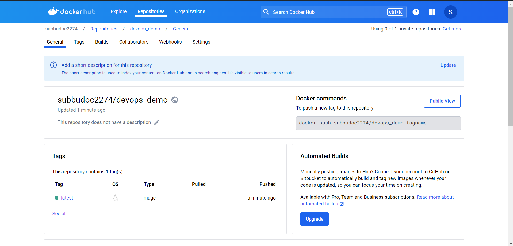

## Devops - Automated Builds Pushing to Dockeruhub Intro
1. created all files from scratch
2. followed the step as per this [video Automated Builds Complete Demo](https://www.youtube.com/watch?v=PZVT1IOC0Zo)
3. below is the screen short of image in my Docker account here.

